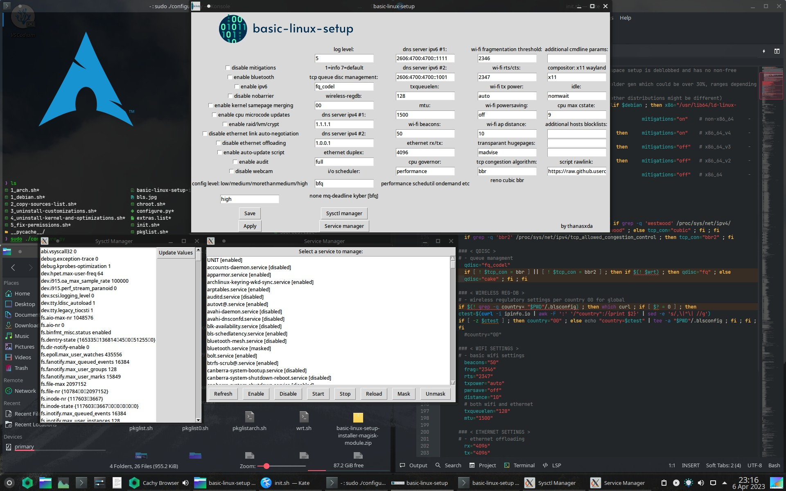

# BASIC-LINUX-SETUP
### Debian Testing/Sid & Arch/EndeavourOS GNU/Linux scripts
note: On default setup Debian benches best, with this setup however go with Arch/based btw,
or Clear Linux if you don't mind using it.
Put your own persistent config within the $PWD this script will run from to override settings yet keeping sync intact.
For Android /data/adb/services.d/.blsconfig (example: `debloatandroid=no ; androidfstab=no ; androidbuildprop=no`)
For Desktop and Openwrt /etc/.blsconfig (example: `mitigations=on`)
Unfortunately it will be too much effort making the setup compatible with many variants of distributions. Check before you run.


## DISCLAIMER:

<sup>**!!!SCRIPTS ARE INTENDED FOR PERSONAL USE ONLY. USE AT OWN RISK!!!**</sup>
<sup>**I AM NOT RESPONSIBLE IF YOUR SYSTEM GETS MESSED UP OR ANYTHING ELSE THIS SCRIPT MIGHT LEAD TO. ONLY DEFAULT BRANCH MIGHT BE UPDATED. SETUP ALSO DISABLES CRUCIAL SECURITY FUNCTIONS SUCH AS MITIGATIONS SACRIFICING SECURITY IN FAVOR OF PERFORMANCE. MITIGATIONS=ON ONLY FOR V4 INSTRUCTION CAPABLE AND ALL NON X86_64 CPU'S CAUSE OF NOT BEING WORTHWHILE. I RECOMMEND FORKING AND MODIFYING IT TO YOUR OWN PERSONAL NEEDS. README IS INTENDED FOR INEXPERIENCED USERS UP TO ABSOLUTE BEGINNERS OPTING TO USE THIS SCRIPT. SCRIPTS ARE USER FRIENDLY, PROMOTING CUSTOMIZATION. _NOTE_: README PROBABLY HAS LEAST PRIORITY OF BEING UPDATED. LOTS OF FORCE PUSHING AS WELL.**</sup>

## Foreword:

I am not a developer nor a professional, just an average Linux user at best case. Scripts are slapped together just to get the job done. Minimal effort and maintenance. Only might have a quick update here and there mainly changing packages when I happen to use these scripts. Remember this readme as stated above is made even to be used by the most absolute beginners for the sake of a better experience when using Linux, these scripts or even modify the scripts and configuration.

## About:

*__Basic-linux-setup__ is a quick script to setup Linux. It is meant to be used with KDE desktop environment. There is a small subsection for OpenWrt and/or any general device running Android or Linux wanting to benefit from kernel parameter configuration. In short this is a multi setup containing everything from full Linux for desktop up to Linux configuration for general devices. Its purpose is basic automatization of a freshly installed system for convenience and optimize Linux devices in general for performance. This is done through configuring userspace and kernel. Additionally also includes drivers, codecs, general packages, zsh shell customization, KDE preconfiguration, browser preconfiguration and extras in case of the full desktop system. The scripts in this newer setup have been slimmed down to function as a base more or less for your own setup.*

## Troubleshooting & additional information:

For extensive troubleshooting on Linux in general and additional information on this setup refer to the old readme, mainly for beginners: [check here](https://github.com/thanasxda/basic-linux-setup/tree/kali-master).
If you get stupid wallpapers change reddit from `earthporn wallpaper` to `earthporn` or any other reddit.
## Instructions for all devices:

**For the full setup of basic-linux-setup on x86 copy paste underneath line in console to start:**
```
sudo apt update && sudo apt -f install -y git && git clone -j32 --depth=1 -4 --single-branch https://github.com/thanasxda/basic-linux-setup.git && cd basic-linux-setup && git checkout master && chmod +x *.sh &&
firstrun=yes ./1_debian*/1_arch* (or any other future distro that might be included.)
```
**For parameter configuration only, running any distribution on x86, OpenWrt, Open/Libre-elec & Linux devices in general, copy paste:**
```
wget https://raw.githubusercontent.com/thanasxda/basic-linux-setup/master/init.sh -O /tmp/init.sh && chmod +x /tmp/init.sh &&
firstrun=yes sh /tmp/init.sh
```
**For Android, install [__Busybox__](https://forum.xda-developers.com/t/tools-zips-scripts-osm0sis-odds-and-ends-multiple-devices-platforms.2239421/) and copy paste in [__terminal__](https://store.nethunter.com/packages/com.offsec.nhterm/):**
```
su
# After copy & paste
if [ -f /system/xbin/sh ] ; then export xbin="/system/xbin/" ; fi
cd /sdcard && rm -f init.sh
"$xbin"wget https://raw.githubusercontent.com/thanasxda/basic-linux-setup/master/init.sh
"$xbin"chmod +x init.sh 
firstrun=yes "$xbin"sh -x init.sh
```
Also available for installation in the form of a Magisk module which is the recommended installation method: [__Download here__](https://raw.githubusercontent.com/thanasxda/basic-linux-setup/master/basic-linux-setup-installer-magisk-module.zip).
Reboot and connect to internet after flashing the module for it to get activated. You must install the [__Busybox__](https://forum.xda-developers.com/t/tools-zips-scripts-osm0sis-odds-and-ends-multiple-devices-platforms.2239421/) Magisk module which is located in `/system/xbin` for it to work. Legacy devices especially when using older Busybox binaries.
After reboot the first run of the setup which happens automatically when connected to the internet might take a bit on older devices, once finished a final reboot is needed for everything to get activated. This is only on the first run, you know its done when the script is placed under `/data/adb/service.d/init.sh`. If it's not done and you reboot too early the Magisk module will rerun the setup in first run mode. Once the first run is complete it will execute normally on every reboot. If youre online it will automatically fetch latests updates from this repo on every reboot and execute them on every next reboot. Otherwise the setup will use local settings and not update anything. Setup will also enable F2FS support on Android.

_Since script tries to aim for compatibility, if you have troubles booting the script enable [__init.d__](https://forum.xda-developers.com/attachments/update-kernel_init-d_injector-ak2-signed-zip.3761907/)_ _support. This should only be necessary when not being able to run [__Magisk__](https://github.com/topjohnwu/Magisk/releases)_. _All links to the downloads are in this text._

**For OpenWrt basic setup check out:**
```
wget https://raw.githubusercontent.com/thanasxda/basic-linux-setup/master/wrt.sh -O /tmp/wrt.sh && chmod +x /tmp/wrt.sh &&
sh /tmp/wrt.sh
```
Note: Only been tested by myself personally on x86 and OpenWrt. Not compatible with your device? Leave note and contribute by giving information for me to include it. 
__DO NOT FORGET IT IS STILL IN EARLY STAGES AND REQUIRES MORE WORK TO BE FLAWLESS WITHOUT BUGS, AT LEAST ON DEVICES IT HAS NOT BEEN TESTED ON YET!__

## Support over distributions:

Currently supports [Debian](https://www.debian.org/) & [Arch](https://archlinux.org/) in the sense of a full-setup script. For debian distributions most likely changing the sources.list will do. As for Arch based distributions most likely it would only support [EndeavourOS](https://endeavouros.com/) because of it being very close to vanilla Arch by sharing the same repositories. The full-setup scripts are post-installation scripts so in the case of Arch does NOT include the full instalation of Arch.
If you cannot boot to sddm check if everything including is installed, including drivers. Make sure `root=` present in bootparams.
Systemd-boot is preferable if uefi support is present during installation.
Since systemd-boot works a bit different than grub, when booting press any unused F keys or arrows to check the setup if needed. `e` to edit entries.

## Quick notes for the full-setup of Arch Linux on x86:
Unless you have never installed Arch the official way it is nice for educational purposes.
Else, flash Arch on usb gpt partition table, uefi boot preferably.
Once booted remove the usb since it will be loaded on ram and the official installer has issues at least for me it won't install when plugged in.
After run `archinstall`, configure preferably F2FS, install.
Once booted into KDE run the script.
Yay is buggy in scripting if it cannot install packages run `./pkglistarch.sh` standalone.
If you get segmentation faults during any compilation alternative reason might be overclocking, low vcore.
If you do not see systemd-boot in archinstall while your hardware has support you either have not booted into uefi mode or did not flash the bootable drive correctly.
ALHP repositories -O3 LTO supporting v2/v3 and cachyos v4 x86 instructions will be automatically enabled if supported.
The rest might be risky.
Comes with clear-linux kernel by default.
If the setup for some reason does not boot after installing the full script probably systemd-boot did not properly update parameters.
Edit parameters options during systemd boot entry list press `e` and enter `root=/dev/<your rootfs>`. After boot rerun the script with `sudo su ; firstrun=yes sh /path/to/init.sh`.
All should work after.

## Quick notes for the full-setup of Debian Testing on x86:

Since most people, myself included value stability and I will not maintain the full-setup no more,
this setup has switched from using Kali to using Debian Testing as base.
All foreign repositories have been removed.
Chances are it will keep working despite lack of intensive maintenance.
If you have issues with this setup it's not me, its Debian repositories.
My efforts will go in the general parameter script instead which is multi device.
Setup can be upgraded with `dist-upgrade`.
DO NOT use `apt upgrade -t unstable` etc or any other branch, unless you don't care of dependency issues on rare ocassions.
Experimental branch is just included for a cronjob fetching mainline kernel and will not be used by default unless specified.
Worst case it might get included in aptitude when solving dependencies which you do need to be wary of, not otherwise. Hash it out in cases as such.

As for the notes... Debian might be a bit trickier to install for beginners.  [__DOWNLOAD DEBIAN TESTING HERE__](https://cdimage.debian.org/cdimage/weekly-builds/amd64/iso-dvd/debian-testing-amd64-DVD-1.iso).

Flashing on usb:
```
fdisk -l # check partition
dd if=(drag drop iso here) of=/dev/sdX# status=progress
```
Installation:
I don't know if regular installation allows for executing a shell within the setup but expert install does.
The setup, as far as expert install, again don't know if it's in regular install as well... 
Prompts if the user wants to have a root account to login from or use a standard user account with elevated root permissions.
DO NOT choose a root account to login from, choose the latter. If fdisk isn't included in shell, the installation menu allows loading modules for it to be selected during installation.
This can be rectified after however in the `/etc/sudoers` file.
You can go back any time to the menu and configure this just by pressing back button.
Graphical/install, when you reach partitioning go back. Select execute a shell from menu.
If your partitions aren't setup the way you want them you could do that through the setup's partitioning options as well...
Just for formatting the disk you want to have for the operating system even after partitioning you could reformat it with a blocksize of 4096.
```
fdisk -l # check partition
mkfs.xfs /dev/sdX# -b size=4096 -f && exit
```
Continue with the setup and select manual partitioning, select drive WITHOUT reformatting as you've just set the optimal blocksize which setup does NOT.
If no GPU drivers are installed on first boot (probably because non-free software is not included by default), example underneath:
```
ctrl+alt+F5 # login
sudo su
```
Assuming you followed advice by not enabling the root account and instead you have a regular user account with elevated persmissions
Sources.list will probably not be included so head over to your basic-linux-setup folder.
Btw, if you did not choose mountpoints for a partition you can still do so by doing:
```
sudo fdisk -l # check partition you want to mount
```
After you have the partition for example `/dev/sda3` and its xfs you would do the following to mount it:
```
sudo mkdir -p /media/mount && echo '/dev/sda3 /media/mount xfs 0 0' | sudo tee -a /etc/fstab
```
Or just manually edit the fstab with nano. Reboot after. Or temporarily mount.
All these steps shouldn't be needed, their explained just in case they are.
```
grep testing /media/mount/basic*/sources.list | sudo tee /etc/apt/sources.list
# Or just use nano to edit the repository in manually like so:
nano /etc/apt/sources.list
# Add it:
deb http://ftp.debian.org/debian testing main contrib non-free
```
The setup will replace the repositories anyway, it's just for installing the GPU driver in case of it not coming preinstalled in the testing iso.
Trying to be very beginner friendly here. As for complete beginners the | just passes on the output to another application, to reduce the confusion.
You do not need to install Linux this way, nor is console needed after being done with the full setup. It can be compared to Mac os for people having a wrong impression, especially KDE I consider... easier than Windows.
Besides the point, install the GPU driver: (Note that underneath method could just as well be replaced by packages: `firmware-linux-nonfree` `firmware-misc-nonfree`. Check what hardware needs nonfree drivers basically.)
```
sudo apt update && sudo apt install firmware-amd-graphics && systemctl reboot # used amd graphics in example here
# Boot linux. > basic-linux-setup > open terminal > ./1* # hit enter.
```
Install setup. Reboot. Done.
The configuration script has configurable variables to change the setup, disable syncing from this repo to override it with your own config or uninstall the config more or less and can be applied to general Linux devices.
The extra scripts within this setup are leftovers from past [thanas-x86-kernel](https://github.com/thanasxda/thanas-x86-64-kernel) and are not needed.
Since things are changed with Debian repositories to keep this setup stable no usage can be made out of dist-upgrade/full-upgrade or upgrading with branch specification.
To fix KDEconnect in this setup:
```
sudo systemctl stop firewalld ufw
# Pair your device
sudo systemctl start firewalld ufw
```
If your benches aren't good rerun the setup: 
```
sudo su ; firstrun=yes sh init.sh ; reboot
```
Experimental only used for kernel.
Setup gives choice for sid/testing.

Depending on if you use mitigations or not you can test your browsers [here](https://webkay.robinlinus.com/).
Keep in mind if sites have trouble loading, because mitigations=off by default the setup uses javascript blockers within browsers. librejs for firefox, noscript for brave.
Make sure to check 'cat /proc/cmdline' if cmdline parameters are successfully configured.
Reconfigure your UEFI boot entry if needed from within the bios.
If you have trouble connecting to the internet manually assign DHCP addresses in networkmanager.
Since systemd-boot and kexec only warm reboot you have to use `coldreboot` to enter uefi bios.
For efi systems `Linux Boot Manager` is systemd-boot which skips udev.
If you end up in busybox when using systemd recheck fstab for faulty entries.
In the past benchmarks would differ a lot accross distribution however since the script configures a lot more than in the past it more or less gets normalized and when the script is present scores are more or less the same in hackbench despite of distribution.

## Main contents:
---
   - [configuration](https://github.com/thanasxda/basic-linux-setup/blob/master/init.sh)
***
   - [basic openwrt setup](https://github.com/thanasxda/basic-linux-setup/blob/master/wrt.sh)
___

## Additional information:

 Repositories:
  - [__sources.list__](https://github.com/thanasxda/basic-linux-setup/blob/master/sources.list)

  - [__extras.list__](https://github.com/thanasxda/basic-linux-setup/blob/master/extras.list)
  
 Mitigations:
  - [__mitigations=off__](https://www.phoronix.com/review/3-years-specmelt)

 Recommendations for bios:
  - [__me_cleaner__](https://github.com/corna/me_cleaner)
  - [__coreboot__](https://github.com/coreboot/coreboot)

 For kernel parameters check:
  - [__linux - kernel parameters__](https://raw.githubusercontent.com/torvalds/linux/master/Documentation/admin-guide/kernel-parameters.txt)

 Filesystems:
  - [__XFS/F2FS__](https://www.phoronix.com/review/linux-58-filesystems/2)
  
## Recommendations:

   - Disabling __HPET__ or any timers used in bios.
   - Formatting disk to __blocksize 4096__ on __XFS__ on __GPT__ partitioning table while disabling __MBR__ in bios and choosing __UEFI__ mode only. If using anything Arch based pick __F2FS__.
     This can be done prior or during expert installation not sure if with the regular setup, you drop down in shell: _"Execute a shell"_ and for example: `fdisk -l ; mkfs.xfs /dev/sda2 -b size=4096 -f`
   - In case of Intel using [__me_cleaner__](https://github.com/corna/me_cleaner) don't know if AMD has a counterpart fix.
   - Modifying the setup to __your own needs__.
   - If your hardware supports gpu rebar enable it in bios, the setup is configured to enable it.
   - Kdeconnect app is nice to have on Android.
   - Having a minimum of __2GB RAM__ for the full Kali Linux KDE setup. As for the preconfiguration, no limit for generic devices.
     Zswap + zram enabled by default for devices of 2GB or less except for OpenWrt, Tvboxes & Open/Libre-elec.
     Memory management dependent on the amount present. Different amounts different settings.
     In the case of a low spec system make use of a separate __swap__ partition if using desktop.
     Always prefer a swap partition over a __/swapfile__ due to relative performance.
     Mind you Linux in combination with KDE only uses up 400MB/600MB ram max, it's heavy applications that don't.
     [__Swap on vram__](https://wiki.archlinux.org/title/Swap_on_video_RAM) is also possible.

## Command line parameters on Android:

Note that hijacking the kernel command line parameters through userspace was a lazy effort as I am focused solely on userspace configuration through this setup. It is however very easy since chances are slim many devices will support this, doing this on other devices without recompilation. For example on Android the boot.img can be extracted, configured and repacked with kernel command line parameters and changes within the fstab if the fstab happens to be on the ramdisk instead of on a device partition. One of the many methods of achieving this explained underneath by example. Hackbench and other tools are also availabe on Android under Magisk module [benchkit](https://github.com/kdrag0n/benchkit/releases/tag/v2.0.0). It's also possible running Linux in chroot within Android if you need more or if you would like to keep it minimal [termux](https://termux.dev/en/). Most devices will have a kernel which will not read added parameters at boot, mainly for security. However if it does, the kernel can be adjusted either from hijacking /proc/cmdline or from the command line parameters within the boot.img. Same goes to OpenWrt btw. Not to every device however. In case of making your own kernel make sure to check out options such as `CONFIG_CMDLINE_FROM_BOOTLOADER`, `CONFIG_BUSYBOX_DEFAULT_FEATURE_INIT_MODIFY_CMDLINE` etc. Note that changes should be seen in `cat /proc/cmdline`. `dmesg | grep "Command line"` doesn't show everything even when it's enabled. It is worth if your kernel supports this configuring it from userspace, as compilation takes time and effort and can't apply to multiple devices simoultanious if they differ.
```
git clone -j32 --depth=1 -4 --single-branch https://github.com/thanasxda/AIK
cd AIK
# Enter adb shell on device
adb shell
su
cat $(grep /boot /path/to/fstab* | awk '{print $1}') > /sdcard/boot.img
exit
# Exit adb shell from device
adb pull /sdcard/boot.img boot.img
sudo su
./cleanup.sh
./unpackimg.sh boot.img
# If your fstab is on ramdisk then...
nano ramdisk/fstab*
# Editing linux kernel command line parameters
nano split_img/boot.img-cmdline
# Flags that are worth for commandline might be: cgroup_disable=memory and for newer kernels above 5.1.13 mitigations=off, older kernels must call mention the individual mitigations, for fstab: lazytime.
# Disabling mitigations on older kernels for arm64: spectre_v2_user=off ssbd=force-off kvm.nx_huge_pages=off kpti=0 (also needs 'nokaslr')... more details in the script.
# Now repack the image. Note modifying default.prop on ramdisk is also possible. Modifying init.rc might also be a good idea.
./repackimg.sh
adb push image-new.img /sdcard/moddedboot.img
adb reboot recovery
# Ready for flashing, can script all this in to be automed. Yet safer doing manually.
# You can also flash directly from userspace with underneath method
dd if=/sdcard/moddedboot.img of=$(grep /boot /path/to/fstab* | awk '{print $1}') 
```
Note: This way one could also include F2FS support on Android since the drivers are within the kernel by copying the /data and /cache lines from EXT4 and swapping the flags for the filesystem.

## Extras:

List non-free software:
Debian:
```
dpkg-query -W -f='${Section}\t${Package}\n' | grep ^non-free
```
Arch:
```
absolutely-proprietary
```

## Bash help:

   - [sed](https://www.pement.org/sed/sed1line.txt)

   - [awk](https://www.pement.org/awk/awk1line.txt)

   - [shellcheck](https://www.shellcheck.net/)
   
   - [bash-hackers wiki](https://wiki.bash-hackers.org/start)

## Links:

   - [thanas-x86-kernel](https://github.com/thanasxda/thanas-x86-64-kernel)
   
   - [linux kernel - parameters](https://raw.githubusercontent.com/torvalds/linux/master/Documentation/admin-guide/kernel-parameters.txt)

   - [linux kernel - x86 general](https://docs.kernel.org/x86)

   - [arch wiki - improving performance](https://wiki.archlinux.org/title/Improving_performance)

